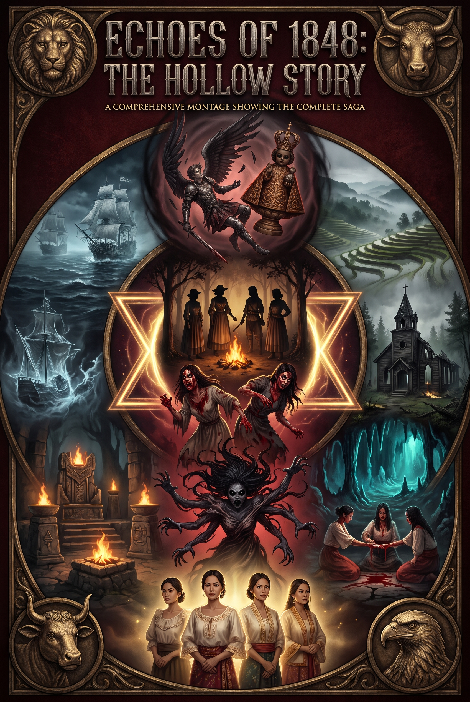

# The Hollow



*A Filipino-diaspora cosmic-horror saga told across ten concept albums — prose, lyrics, and music fused into one unbroken count.*

The Hollow is the central horror cycle of the Echoes of 1848 creative universe. What begins as one ordinary camping trip by four Filipino women into the deep woods of eastern Kentucky becomes, album by album, a four-century reckoning with an ancient hunger that has been counting since before the light.

## The story

**Red Hollow, Kentucky.** Four friends — Lina, Marisol, Tess, and Jo — take a weekend trip to a forgotten fold of woods that locals call Red Hollow. By the third night, the forest has finished their sentences, borrowed their skin, and made them an offer phrased as friendship, attraction, and devotion. They leave in one truck with four bodies and uncertain souls, carrying a new intimacy that is part devotion, part infestation.

But the hollow did not begin in Kentucky. It began in a void before creation, was first refused by godhood's own daughters, and was carried across the Pacific inside four family bloodlines — the busaw healers of the Visayas, the mangkukulam of the Tagalog lowlands, the babaylan who turned to the serpents of deep earth, and the anito families of Bicol who fed their dead a thread of living red. The count is arithmetic: ten, eleven, twelve, and one to come. Four bloods made it possible. One fire becomes four.

At the center of the resistance stands **Dalisay**, the woman who refused the covenant, descendant of those who said no to divinity, keeper of Lumawig's bamboo library above Batad. The saga asks a single question in a hundred ways: *if a spirit uses your mouth to say "I love you," and your heart answers — who is speaking when you answer back?*

Canon, timeline, and terminology — including a glossary of the Filipino terms in the lyrics and the count's arithmetic — live in **CANON.md**, the single source of truth the stories, lyrics, and tags all follow.

## The series

Each installment is a complete story-album: a prose novella (`Album.md`), per-track lyrics, and a track-by-track album (MP3), with an album cover (`*_COVER.png`) beside it — and the saga-wide montage `Echoes-of-1848_The-Hollow-Story.png` lives at the repo root.

### Release order

The order each installment was released.

1. **The Red Hollow of Kentucky** — the opening chapter: four friends, one campsite, one red cooler, and the thing that counts them.
2. **The Amuyao Covenant** — the thing from Kentucky follows them home to the mountains of Luzon.
3. **The Unholy Blood** — the temple beneath Manila, the gathered followers, and the star that wants its center.
4. **The Permanent Season** — the barrier is a denial, not a wall — and the blood of the newly born sings.
5. **The Solitary Path** — thirty years of refusal: Dalisay above Batad, alone with Lumawig's texts.
6. **The Hollow Destroyed** — thirty-two years on, Ulan is called by dreams. The Restoration.
7. **The Darkness Arrives in Cebu** — 1565. The sandugo, the child in the box, and the fourth name that goes into the water.
8. **The Eleventh Figure** — 1565–1841. Ten figures on the manifest, eleven in the store-room at Acapulco.
9. **Bloodlines** — 1565–present. Four grandmothers sing the count across the widest water in the world.
10. **Dawn of the Void** — the beginning: Dalisay's vision of the void before light, and the daughters who refused.

For track listings and runtimes per album, see the table below (canonical numbering: the main line 1–6, the prequels P1–P3, and the unnumbered origin).

| # | Album | The track | Tracks | Runtime |
|---|-------|-----------|--------|---------|
| 1 | **The Red Hollow of Kentucky** | Four friends, one campsite, one red cooler, and the thing that counts them | 10 | ≈30m |
| 2 | **The Amuyao Covenant** | The thing from Kentucky follows them home to the mountains of Luzon | 12 | ≈50m |
| 3 | **The Unholy Blood** | The temple beneath Manila, the gathered followers, and the star that wants its center | 12 | ≈39m |
| 4 | **The Permanent Season** | The barrier is a denial, not a wall — and the blood of the newly born sings | 13 | ≈40m |
| 5 | **The Solitary Path** | Thirty years of refusal: Dalisay above Batad, alone with Lumawig's texts | 12 | ≈49m |
| 6 | **The Hollow Destroyed** | Thirty-two years on, Ulan is called by dreams. The Restoration. | 17 (16 + bonus) | ≈1h 04m |
| P1 | **The Darkness Arrives in Cebu** | 1565. The sandugo, the child in the box, and the fourth name that goes into the water | 12 | ≈28m |
| P2 | **The Eleventh Figure** | 1565–1841. Ten figures on the manifest, eleven in the store-room at Acapulco | 12 | ≈27m |
| P3 | **Bloodlines** | 1565–present. Four grandmothers sing the count across the widest water in the world | 12 | ≈34m |
| — | **Dawn of the Void** | The beginning of The Hollow: Dalisay's vision of the void before light, and the daughters who refused | 15 | ≈1h 03m |

Full saga runtime: **≈7h 05m across 127 tracks** (measured 2026-08-27) — every album is sized for a single sitting.

Full credit on every track is **Echoes of 1848** — see *Making the media* below for the shipped ID3 metadata.

## What's inside an album folder

```text
Album-Name/
├── Album-Name.md                        # the full prose story
├── NN - Title.md                        # per-track lyric file (title heading + Lyrics section)
└── NN - Title.mp3                       # generated track
```

The musical identity of the saga is a deliberate fusion: death, symphonic, and thrash metal braided with kulintang, agung, gangsa, kudyapi, dabakan, bamboo flutes, and the subing jaw harp — the oldest instruments of the islands played alongside the loudest of the new country, sung in the voices of grandmothers who have decided the young must survive what the old prepared.

## Making the media

Tracks are generated from the lyric files in directory mode: each `NN - Title.md` carries a `## Lyrics` section, and a single run renders every track for the album. Always preview with a dry run before generating, then commit each `NN - Title.mp3` next to its lyric file so the base names match, and verify the whole repository with `scripts/check-parity.sh` before pushing. API keys live in `.private/config.json`, which is never committed.

Tracks are AI-generated (Suno); each MP3 ships with a canonical ID3v2.3 tag set written by `scripts/tag.sh` — artist and album artist **Echoes of 1848**, prettified album title, track title and number, genre **Mixed**, year **2026**, the full lyrics as an `USLT` frame (synced from `NN - Title.md`), and a `COMM` comment preserving the original Suno track ID. The tag pass touches metadata only — decoded audio is byte-identical. Re-run `scripts/tag.sh` after every regeneration, then `scripts/check-parity.sh`, which now verifies the tag layer as well.

## Repository layout

- Ten album folders, each a self-contained installment (see the table above).
- `scripts/check-parity.sh` — verifies every track's MD↔MP3 base-name parity, per-folder track counts, and the ID3 tag layer (artist/album/track/genre/year/lyrics); passes clean on all ten albums and exits non-zero on any mismatch.
- `scripts/tag.sh` — distribution-ready ID3v2.3 tag pass over all MP3s (title, track number, artist **Echoes of 1848**, prettified album, genre, year, embedded `USLT` lyrics, preserved Suno comment). Metadata only — audio bytes untouched.
- `CANON.md` — the canon: a chronological timeline with anchors, a glossary of Filipino terms in the lyrics, and the arithmetic lock (the count, the four/fifth invariants, the ages that pin them); the automated checks in `check-parity.sh` enforce the canonical parts.
- `.github/MEMORY.md` — workspace memory for AI agents (canon, conventions, discrepancies, workflow); tracked normally.
- `.gitattributes` — text conventions: all markdown and scripts are LF (normalized 2026-08-27) and MP3s are marked binary; no Git LFS in use, so a plain `git clone` is complete.
- `.gitignore` — excludes `.logs/`, `.private/`, `.temp/`, `node_modules/`, and everything under `.github/` except `workflows/` and `MEMORY.md`; `.private/` holds API config and must never be committed.

## Status

Published to GitHub; `main` is fully pushed. The repository holds the prose stories, per-track lyrics and audio, the album covers, the saga montage, and the generated full-saga exports (`The-Hollow.html`, `The-Hollow.pdf`) — ≈633 MB working tree; a plain `git clone` is complete.

## Characters

The saga's cast, album by album, in release order (the numbered list above). A handful of figures carry the whole series — the four women of Kentucky, the Hollow, and the bloodlines of the old covenants — so the same names recur under several albums; each entry is attributed to the album where that version of them matters most.

### The Red Hollow of Kentucky (Album 1)

- **Lina** — practical and patient; a nurse who books the campsite the afternoon Jo stops answering her phone. Ulan's mother (The Hollow Destroyed).
- **Marisol** — a nurse with the choir pitch in her blood; her wandering begins the song by the fire.
- **Tess** — a nurse by trade and a photographer by wound, forty-four, single by choice; the first to mock the haunting and the first to speak in "we."
- **Jo** — gentle Jo, forty-seven, widowed eighteen months, sleeping in her husband's flannel; the reason the trip exists; the fourth name rests in her "like a door with no key."
- **David** — Jo's husband, dead before the story opens; remembered again in The Hollow Destroyed's *"I Remember My Husband's Name."*
- **The Hollow (the Red Hollow)** — the thing in the cup-shaped valley that counts what gathers (four tents, one fire) and wants a fourth name; its origins are Dawn of the Void and The Eleventh Figure.
- **The man at the gas station** — sells the ice and the warning — *"Ain't nobody camps there no more. Not since the church burned."* — and will not look at the road; the gray-faced man of Bloodlines.

### The Amuyao Covenant (Album 2)

- **The four** — the covenant: naked, blood-marked, one hive in four bodies in the circle of trees on the mountain.
- **The presence that followed from Kentucky** — the Hollow settling deeper into their bones, teaching them the old tongue.
- **The circle of trees and the carved stone** — the sacred grove "where the hunters don't go," humming in the rhythm of their hearts.
- **The village guides** — who spoke of the circle and did not follow.
- **The sacrifices** — the jungle fowl, the goat, the deer that come to the stone without fear and are welcomed.
- **The followers** — collected on the road south, doubling as they go: four, then eight, then sixteen.

### The Unholy Blood (Album 3)

- **Reynaldo** — the pianist from the delta, first of the new followers, doused for dios.
- **The first follower** — the young man who knelt; the pit takes him blackened.
- **The Mothers / the Four-Faced God / the Hollow That Walks** — what the four have become in the temple beneath Manila, gathering the faithful by night.
- **The followers** — the drawn thousands on the plains, waiting for the star.
- **Lumawig** — the mumbaki master who has kept its texts; cuts his own finger to follow the trackless blood, and leads twenty mumbaki into the grove.
- **Dangao** — Lumawig's youngest apprentice, his grandfather's blade in his hand, eardrums burst; he shouts the countermagic again in The Permanent Season.
- **The star** — four points wanting a fifth; the geometry the four are building.
- **The village girl** — the would-be fifth, kept from the circle through the night.
- **The mumbaki of the Mountain Province** — the old men with chicken bones and rusted machetes.

### The Permanent Season (Album 4)

- **The four (bound)** — sealed in the caves beneath Manila by the barrier Lumawig raised: not a wall but a denial, in place for seven years, or seven minutes.
- **Jo** — who finds the crack in the binding: "The barrier holds the hungry. But it does not hold the fed."
- **The pregnant women of Manila** — called in whispers from the shanties, walking in their sleep to the cave mouths.
- **Elena** — the first of them, eight months pregnant with her third child, walking into the deepest chamber as if coming home.
- **Elena's newborn** — a girl, taken before the bond can form; newborn blood is the transformation.
- **The mothers fed to the mothers** — the sacrificed women made to watch, then consumed with their milk not yet dried.
- **The mumbaki** — who held the barrier with the blood of warriors and the prayers of rice gods; **Dangao** shouts at the cave mouth: *"Jo. Remember your husband. Remember David. Remember love."*
- **Lumawig (as legacy)** — the barrier is his; *"Lumawig's Lament"* is the album's seventh track.

### The Solitary Path (Album 5)

- **Dalisay** — forty-six, then forty-seven, thirty years alone above Batad, the accumulated "no"; the vessel of her ancestors' refusals, learning to be "enough."
- **Bugan and Obban** — daughters of Lumawig who refused godhood in the rice field and the childbirth hut; the bloodline that reaches Dalisay.
- **The god who offered** — the unnamed presence that offered them eternal life and was told no, twice.
- **Bathala** — who speaks from the star: *"What they consumed, you will restore. What they took, you will return. Not by blade. By fullness."*
- **The four in dreams** — the hunger wearing Lina's memory, Marisol's voice, Tess's curiosity, and the emptiness that answers to Nara.
- **Lumawig's library and blade** — the texts preserved behind the landslide, and the rusted blade that cut her palm; the words that can unmake what the four made.
- **Dalisay's mother and father** — the dead she speaks to: the mother who died when she was twenty, the father who beat her for her second sight.

### The Hollow Destroyed (Album 6)

- **Ulan** — fifty-two, Lina's daughter, called by dreams to the stone house above Batad; her forgiveness — *"Mother, I forgive you. I love you. Come back."* — breaks the possession.
- **Dalisay (the fifth point)** — steps into the star and completes it with wholeness rather than joining; presides over the wedding at the end.
- **The Empresses of Hunger** — the four merged, the Hollow speaking through four mouths: "They are mine."
- **The Hollow** — starves on the wholeness it cannot digest — *"We are full. We are enough. We refuse you."* — and goes silent; the palace of bone and the Lower Choirs dissolve with it.
- **The bloodlines revealed** — Bathilang's busaw, the mangkukulam shadows, the fallen babaylan's serpents, the anito ghosts: why the four were chosen ("The Hollow recognized its own").
- **The survivors** — freed when the entity starved, they fill the pews as witnesses.
- **Lina and Marisol** — the sacred marriage, six months on: chosen, not forced; the love that waited twenty years.
- **David** — Jo's husband, remembered; *"I Remember My Husband's Name"* keeps his name in the light, and Jo returns to it human.

### The Darkness Arrives in Cebu (P1, 1565)

- **Rajah Humabon** — master of Sugbo, the voice of the red feast, who reaches for an iron alliance.
- **Hara Amihan** — his consort, who sees where the priests are going and gives the child back into its keeper's keeping.
- **The short captain** — the first fleet's captain (Magellan, never named in the text), answered at Mactan by Lapu-Lapu's spear.
- **Lapu-Lapu** — datu of Mactan, who refuses the bargain and answers the sea with a spear.
- **Nara the Keeper** — keeper of Cebu, who has watched the warm child in the hill for forty-four years and insists it is not a god; her name is the one the Hollow later wears to possess Jo.
- **Nara's mother** — the dead babaylan whose voice the child borrows to speak.
- **The boy in the baroto** — the fisherman's boy who brings the news of the five white ships and cannot stop shaking.
- **Rajah Tupas** — Humabon's heir, seven when the feast turned red; years later the datu who watches Sugbo burn from the waterline to the shrine.
- **Sikatuna** — the datu of Bohol, who keeps the sandugo on the white shell strand; **Sikatuna's son**, who hears the warning about the cup.
- **Miguel López de Legazpi** — "the general," a Basque notary with a crown's signature and a widow's grief; his cannonade burns Sugbo in 1565.
- **Fray Andrés de Urdaneta** — the navigator-priest, fifty-six, who fears the cargo they carry in themselves.
- **Fray Martín de Rada** — the Augustinian who baptizes as if washing the world and receives the child's history on his knees.
- **Juan de Camus** — the sailor who finds the tindalo box in the unburned hut and takes it to confession the same night.
- **Nara's granddaughter** — "a girl of the springs," released from the keeper rosters at the old keeper's asking; her daughter is Doña Ignacia (The Eleventh Figure).
- **The warm child** — the thing in the golden case: the eleventh figure, bound at Cebu with four names (one of which goes into the water, making the Hollow's count possible).

### The Eleventh Figure (P2, 1565–present)

- **The tally-man** — the count's clerk on the long road from the islands, dying on the word he made true: "Still eleven."
- **Fray Mateo de la Cruz** — the cathedral priest who reads the archbishop's letter and hangs the golden case above the candles.
- **Lope** — the tally-boy, eleven years old, who learned to read the numbers backwards and told no one.
- **Fray Álvaro** — the friar of the Acapulco store-room who counts eleven figures where the manifest says ten.
- **Bernal** — the old Indio who crossed on the tornaviaje, "the crate's nurse," guarding the tindalo box through the long sea with the mother's eyes and the left-hand cross.
- **The eleventh figure** — the warm copy that slipped aboard: the Niño de la Mar, the Child of the Sea, an image that cannot take a living name but wears the shape of one, and it travels.
- **Doña Ignacia** — the widow from the islands, fifteen years in Mexico City, who attends every Mass and gives it nothing; her last words: *"Count four. It will go where the doors are being built."*
- **Toribio** — the sacristan's boy who steals the Child of the Sea one night and runs twelve miles in his bare feet to put it back before dawn.
- **Lao** — eldest of the sangley carvers of the Parián, whose ivory "true copy of the copy" carried the flat black eyes across the water; he stopped carving saints, carved elephants, and burned his bench.
- **Fray Hernando** — the practical friar of the desert mission of San Antonio, nine nights on his knees, who on the tenth hangs the warm child over the door.
- **Mister Prather** — takes it for a river crossing in the year of the great autumn rains and sells it at the iron bridge.
- **Asa** — the surveyor who carries it through one whole summer in his instrument chest and keeps it, unspoken, to his grave.
- **The country it travels as cargo** — fur traders' packs, tavern hearths, a peddler who dies before his stall, a farm family's root cellar, the long hunters' year of the red water — until it stands on the ridge and chooses a hollow: the green folded hills of Kentucky.
- **The congregation of the two rivers** — who build the 1811 church over the red-creek ground; it hangs above their table until the fire of dry October.
- **The man at the gas station** (epilogue) — "Ain't nobody camps there no more."
- **The ivory carvers' guild of Manila** (epilogue) — who draw the curtain on the last warm figure.

### Bloodlines (P3, 1565–present)

- **The grandmothers** — four choirs standing where thresholds thicken, "the fire not yet lit" (the epilogue's singers of the count).
- **Bathilang** — the ancient Visayan witch who prayed to the busaw, spirits of corruption: Lina's line, before 1565 to "the false names."
- **The mangkukulam** — the Tagalog covenant-sorcerers, shadow for shadow, name for name: Marisol's line.
- **The babaylan who turned** — the light-bearer who gave up the good weather and took the patience of what lives under it: Tess's line.
- **The anito keepers of Bicol** — the feeders of ghosts, "keepers of the fourth name since 1565": Jo's line.
- **Lina, Marisol, Tess, and Jo** — the inheritors, recognizing in themselves the triage lists, the choir pitch, the plural *we*, and the fourth name resting in Jo "like a door with no key."
- **The man with the gray face** — at the filling station along the old road, selling ice and never looking at the road.

### Dawn of the Void (the origin, before Creation)

- **The Most High** — God; the Throne at the center of the singing, pouring light out into the dark.
- **The Word** — the Son, the door through which all things are made; speaks the first light after the burial.
- **Tohu** — the last of the great ones, made of space rather than light: the lantern of the threshold, the vessel that passes the Throne's light into the far dark. Buried beneath the world, starving on fullness, he becomes **the Hollow**.
- **Samael** — the Bright One, the Son of the Morning, the seal of perfection; his resentment of the love poured through Tohu begins the war in heaven, and a third of the host falls with him.
- **Michael** — the archangel, "Who is like God?"; the wall that keeps the music from collapsing, leader of the faithful ranks.
- **Gabriel, Raphael, and Uriel** — the herald who is the first to weep, the healer who meets the first wound he cannot close, and the fire of God who commands the loyal host.
- **The Cherubim** — the four-faced chariot (lion, ox, man, eagle); the origin of every count in four the Hollow is later caged by.
- **Bathala the Keeper** — the earth-name of the Keeper of the Door, the seal's fifth point, appointed at the first dawn; the anti-appetite who starves on wanting and delivers the doctrine *"Not by blade. By fullness."*
- **Dalisay** — the frame: the one who refused, to whom the oldest scroll shows the dawn of the void (her own story is The Solitary Path).

---

## The artist

**Elysium853** — cosmic horror, told in concept albums. The Hollow saga: ten albums, one unbroken count. Death, symphonic, and thrash metal braided with the oldest instruments of the Philippines — kulintang, agung, gangsa, kudyapi, dabakan, bamboo flutes, and the subing jaw harp — sung in the voices of grandmothers who decided the young must survive what the old prepared.

Elysium853 is the pen behind **Echoes of 1848**, creator of **The Hollow** — a Filipino-diaspora cosmic-horror saga: ten albums, 127 tracks, seven hours. It opens with one ordinary camping trip by four Filipino women into the deep woods of eastern Kentucky and closes with the hunger starved by wholeness — and in between, an ancient appetite follows four family bloodlines across the widest water in the world and learns to count. The work is a production pipeline as much as a creative one: the prose is the canon, the lyrics are the script, and the music is the score — every album a complete story-audio package, and every tracked file kept honest by parity checks, CI gates, signed commits, and ID3 tags that survive redistribution.

Beyond the saga, the archive holds standalone cycles — the memory-tolled ferry of *The Salt Line*, the internment-camp ghosts of *Ash Road to the Fifth Chrysanthemum*, the galleon road of *The Santa Maria's Shadow*, and the cornfield communion of *The Scarecrow Madonna*. And beyond the writing, Elysium853 is a builder of small, reliable machines: Discord bots (ElyAdmin, Wizards-Castle), a zero-dependency multi-provider AI CLI (ElyProjectX), a personal web hub, and a cross-platform automation library — because if it's on this machine, it's documented, verified, and three characters away from a commit, and the machine should always serve the story.

---

## Find the saga online

The prose lives in this repository; the lyrics and audio stream wherever the saga is published. Follow **Elysium853**:

| Platform | Profile |
|----------|---------|
| 🎧 **Spotify** | [open.spotify.com/playlist/6ySpzQpgsavB7MfrFyTobz?si=668052c2076643fe](https://open.spotify.com/playlist/6ySpzQpgsavB7MfrFyTobz?si=668052c2076643fe) |
| 🎵 **Suno** | [suno.com/@elysium853](https://suno.com/@elysium853) |
| ▶️ **YouTube** | [youtube.com/@elysium853](https://www.youtube.com/@elysium853) |
| 🐙 **GitHub** | [github.com/Elysium853](https://github.com/Elysium853) |

### Suno playlists by album

Each album streams on Suno as its own playlist — ten playlists, one unbroken count:

| # | Album | Suno playlist |
|---|-------|---------------|
| 1 | **The Red Hollow of Kentucky** | 🎵 [Play on Suno](https://suno.com/playlist/a72673b4-cb66-4d00-b5ec-575acaabd52c) |
| 2 | **The Amuyao Covenant** | 🎵 [Play on Suno](https://suno.com/playlist/3d6b4e2a-59b4-41cf-bd44-3e39ed3deaf8) |
| 3 | **The Unholy Blood** | 🎵 [Play on Suno](https://suno.com/playlist/09ff6403-6242-417c-a7ef-cf1395b25b1c) |
| 4 | **The Permanent Season** | 🎵 [Play on Suno](https://suno.com/playlist/abfa3986-008b-463b-b45b-327afadeccab) |
| 5 | **The Solitary Path** | 🎵 [Play on Suno](https://suno.com/playlist/33b8e2d8-9e63-4a18-a44b-cf6e43b27fe4) |
| 6 | **The Hollow Destroyed** | 🎵 [Play on Suno](https://suno.com/playlist/b0ab041b-0d53-436e-a71b-316c5e53124e) |
| P1 | **The Darkness Arrives in Cebu** | 🎵 [Play on Suno](https://suno.com/playlist/a16f6921-0067-472d-9fe8-b26ed9a2ce75) |
| P2 | **The Eleventh Figure** | 🎵 [Play on Suno](https://suno.com/playlist/25ffcf14-fee4-4c7c-aa9e-69db2428e062) |
| P3 | **Bloodlines** | 🎵 [Play on Suno](https://suno.com/playlist/89d18fd1-2737-4a94-b394-2868e29db292) |
| — | **Dawn of the Void** | 🎵 [Play on Suno](https://suno.com/playlist/a00f68ca-802c-4449-9222-b6df838c56fa) |

---

## License

Copyright © 2026 **Elysium853** — all rights reserved. This repository and everything in it — the **Echoes of 1848** universe: prose, lyrics, music and audio, artwork, names, and canon — is the intellectual property of **Elysium853** (GitHub: https://github.com/Elysium853 · Discord: elysium853, user ID 1468634923480125697). The audio was created under a Suno Pro membership, under which the member owns the audio they generate. See [LICENSE.md](LICENSE.md) for the full terms.
